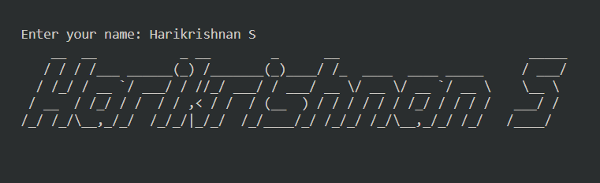
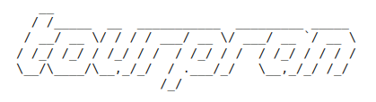
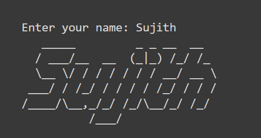
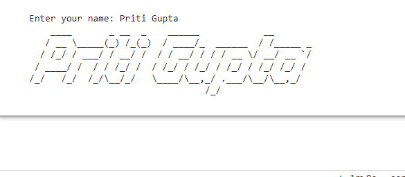
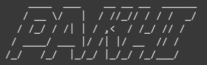
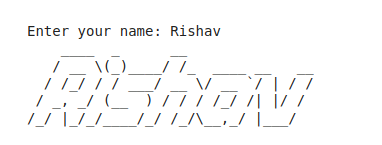

# Contributors

<table align="center">
<tr>
  <th>Contributor</th>
  <th>Contribution</th>
</tr>
<tr>
<td align="center"><a href="https://github.com/hks3333"> <b>Harikrishnan</b></a> </td>
<td align="center"></td>
</tr>
<tr>
<td align="center"><a href="https://github.com/vishalj0501"> <b>Vishal</b></a> </td>
<td align="center"></td>
</tr>

<tr>
  <td align="center">
    <a href="https://github.com/BolisettySujith">
     <b>Bolisetty Sujith</b></a> </td>
    <td align="center"></td>
</tr>

<tr>
<td align="center"><a href="https://github.com/priti164/hacktoberfest-2022.git">
width="100px;" alt=""/> <b>Priti</b></a> </td>
<td align="center"></td>
</tr>

<tr>
<td align="center"><a href="https://github.com/DeadlockVector"> <b>Aaditya47</b></a> </td>
<td align="center"></td>
</tr>

<tr>
<td align="center"><a href="https://github.com/yami6969"> <b>nikhil</b></a> </td>
<td align="center"></td>
</tr>

<tr>
<td align="center"><a href="https://github.com/pruthvipisal/"> <b>Pruthviraj</b></a> </td>
<td align="center"></td>
</tr>

<tr>
<td align="center"><a href="https://github.com/kaarthikrishna"> <b>Vishal</b></a> </td>
<td align="center"></td>
</tr>

<tr>
<td align="center"><a href="https://github.com/Pakhi07"> <b>Pakhi Banchalia</b></a> </td>
<td align="center"></td>
</tr>

<tr>
<td align="center"><a href="https://github.com/vishalj0501"> <b>Vishal</b></a> </td>
<td align="center"></td>
</tr>
<tr>
<td align="center"><a href="https://github.com/rishuriya"> <b>Vishal</b></a> </td>
<td align="center"></td>
</tr>

</table>
